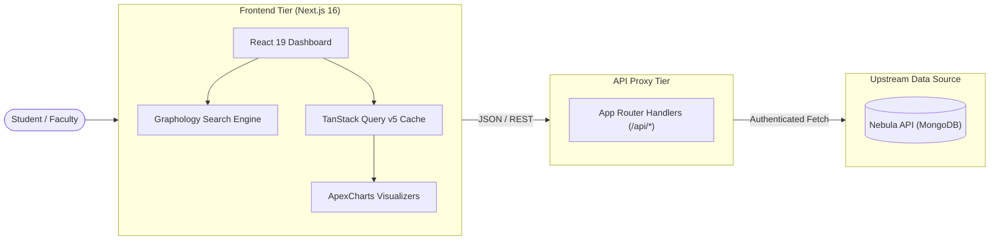
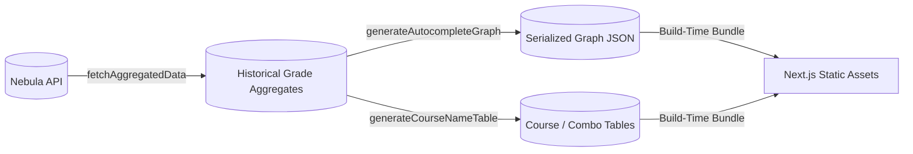

# Project Architecture

UTD Trends provides fast, intuitive access to university grade history and instructor performance data. This document outlines the technical architecture, data pipeline, and key libraries driving the application.

---

## High-Level Architecture

---

## Technology Stack

### 1. Application Framework & Rendering

- **Next.js 16 & React 19**: Server and client rendering using the Next.js App Router.
- **Turbopack**: Default incremental bundler in Next.js 16 for local development (`npm run dev`).
- **TypeScript**: Strict type definitions covering all API response models, component props, and grade records.

### 2. Styling & Component Library

- **Material-UI (MUI) v9**: Core component library providing accessible design primitives, dialogs, sliders, and form elements.
- **Tailwind CSS v4**: Utility styling for rapid layout adjustments and custom spacing.
- **Emotion**: CSS-in-JS engine managing MUI component theming and dynamic dark/light styles.
- **Framer Motion**: Smooth spring transitions for expanding cards, search drawers, and mobile layouts.
- **React Resizable Panels**: Powers the split dashboard workspace (search results on LHS, interactive graphs and schedule on RHS).

### 3. Data Visualization

- **ApexCharts & React-ApexCharts**: Renders interactive grade distribution bar charts, multi-semester GPA progression lines, and comparative course overlays.

### 4. Search & Graph Indexing

- **Graphology**: In-memory graph structure indexing course prefixes, course numbers, professor profiles, and section relationships. Enables instant sub-millisecond client-side fuzzy searching without hammering the upstream API.
- **Autosuggest-Highlight**: Tokenizes search terms and calculates highlighted matches inside dropdown queries.

### 5. Data Fetching & Caching

- **TanStack React Query v5**: Handles asynchronous request lifecycles, automatic caching, background staleness re-fetching, and query deduplication across views.
- **Internal API Proxy Routes (`src/app/api/`)**:
  - `/api/grades`: Aggregates historical grade distributions across semesters.
  - `/api/professor`: Retrieves instructor credentials, ratings, and section assignments.
  - `/api/planner`: Fetches course section times and room locations for schedule building.

### 6. Observability

- **Sentry (`@sentry/nextjs`)**: Real-time error boundary captures and performance tracking on edge, server, and browser runtimes.
- **Vercel Speed Insights**: Core Web Vitals monitoring.

---

## Data Pipeline & Pre-computation

Rather than querying full catalogs synchronously, Trends pre-computes static graph indexes during build time:

1. **`src/scripts/fetchAggregatedData.ts`**: Connects to the Nebula API to fetch raw historical grade entries and aggregates them into consolidated metrics.
2. **`src/scripts/generateAutocompleteGraph.ts`**: Converts course codes, titles, and faculty directories into an optimized Graphology directed graph serialized into static JSON.
3. **`src/scripts/generateCourseNameTable.ts` & `generateCombosTable.ts`**: Pre-indexes valid course/professor combinations to eliminate invalid state transitions in search inputs.

---

## Next Steps

Review [Project Structure](Project-Structure.md) to inspect the filesystem layout and understand where each component resides.
